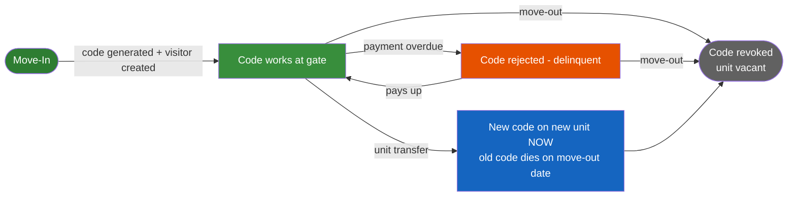
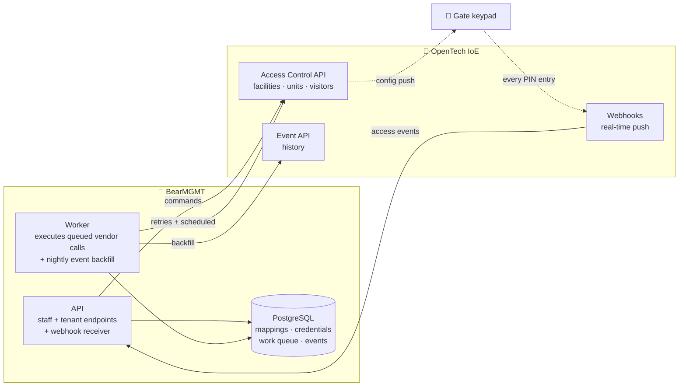
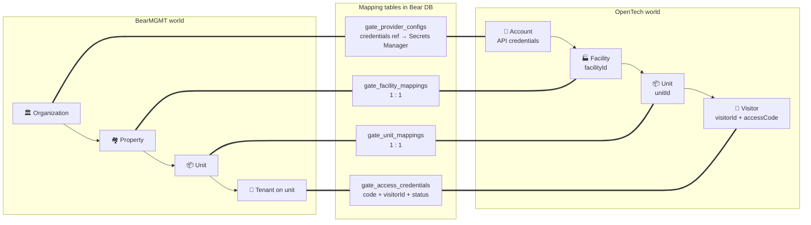
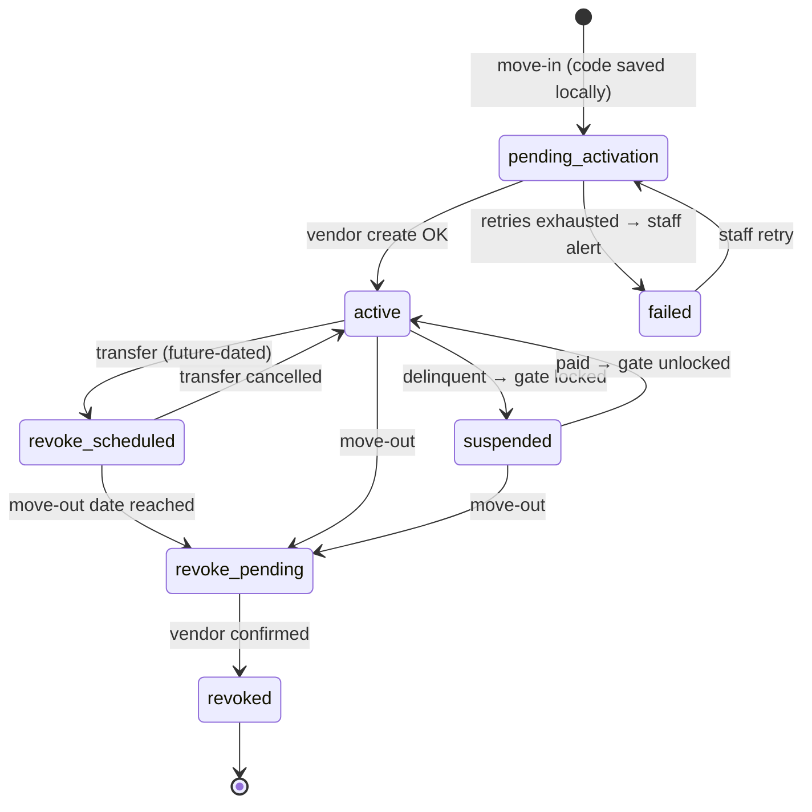
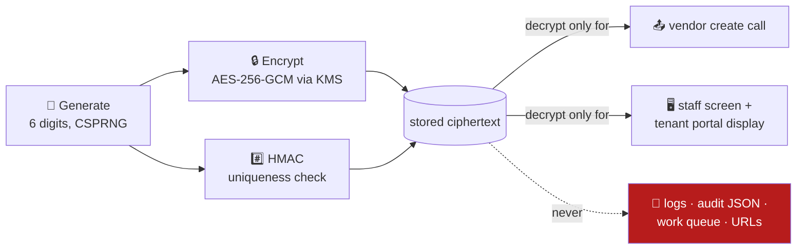
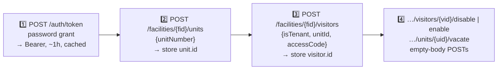
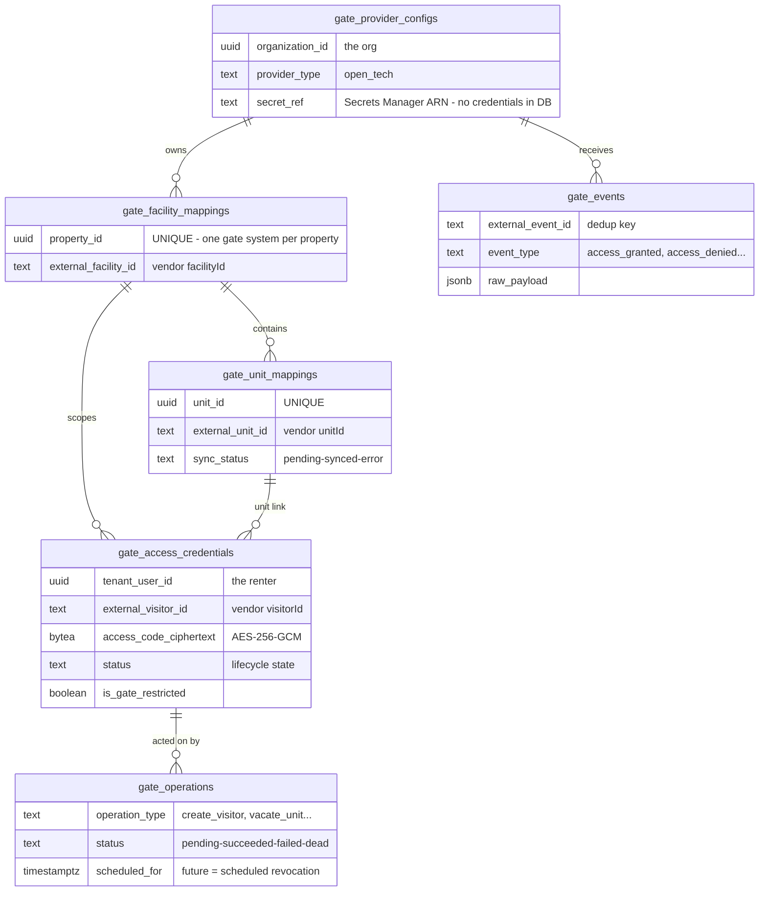
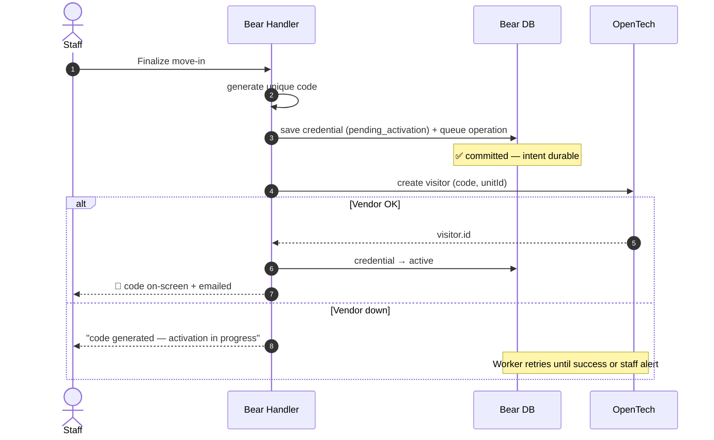
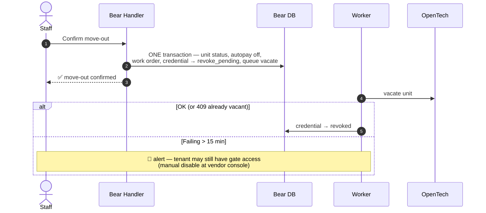
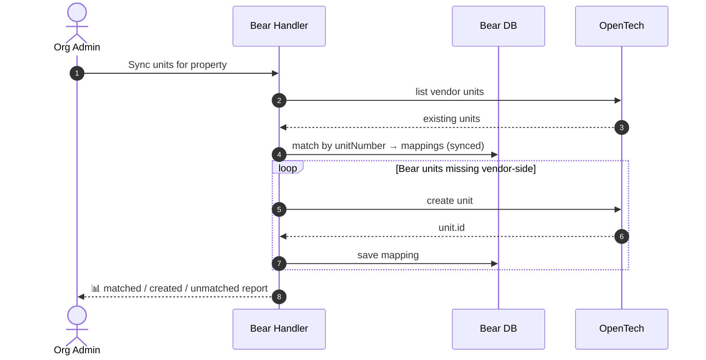

# Gate Access Control — Visual Overview

**BearMGMT ↔ OpenTech IoE integration — the whole design in pictures.**

Self-storage properties have physical gates with keypads. BearMGMT issues each tenant a unique PIN (gate code); the gate hardware is run by a vendor platform — **OpenTech Alliance IoE** — that Bear drives over REST and listens to via webhooks. **Bear decides, OpenTech executes at the gate.**

> Condensed companion to the full design: [gate-access-control-architecture.md](gate-access-control-architecture.md)

---

## 1. The Tenant's Journey in One Picture



Every arrow above is one Bear command that (1) commits to Bear's database first, then (2) calls OpenTech — never the other way round.

---

## 2. The Big Picture



**Four rules carry the design:**

| # | Rule | Why |
|---|---|---|
| 1 | 🔌 **Provider port** — business logic talks to an interface, OpenTech is just an adapter | Swap vendors later without touching business code |
| 2 | 💾 **DB first, vendor second** — intent committed locally before any vendor call | Failures become visible, retryable rows — never silent loss |
| 3 | 📋 **Work-queue table** (`gate_operations`) — Worker retries, schedules, dead-letters + alerts | Survives restarts; future-dated rows = scheduled revocations |
| 4 | 👁 **Events are observational** — webhooks feed dashboards/alerts, never decisions | A missed webhook can't corrupt state; nightly poll closes gaps |

---

## 3. BearMGMT ↔ OpenTech Mapping



- **Recommended:** each organization has **its own OpenTech account** (isolation, blast radius). A single shared Bear account fits the same schema — pending business decision **C-1** (§9).
- **Setup:** Org Admin enters credentials once (write-only → AWS Secrets Manager), Bear test-calls to verify, admin links each property to its facility (Bear suggests by `propertyNumber`, human confirms), then runs unit sync.
- **Two vendor quirks drive the whole data model:** OpenTech assigns `visitorId` itself with **no external key** (Bear must capture it from the create response instantly), and the gate code is **never echoed back** (Bear's encrypted copy is the only one).

---

## 4. Credential Lifecycle (the `status` column)



| Business event | Vendor call | Effect at the gate |
|---|---|---|
| Move-in | `POST …/visitors` | Code works, unit → Rented |
| Delinquent | `POST …/visitors/{vid}/disable` | Code rejected, record kept |
| Paid | `POST …/visitors/{vid}/enable` | Code works again |
| Move-out | `POST …/units/{uid}/vacate` | All unit codes dead, unit → Vacant |
| Transfer | new visitor now + **scheduled** vacate later | Both codes live during overlap |

---

## 5. The Two Key Tables

### 🔗 `gate_unit_mappings` — *"which vendor unit is this Bear unit?"*

| Column | Plain English |
|---|---|
| `unit_id` *(unique)* | The Bear unit |
| `external_unit_id` | OpenTech's numeric `unitId` — needed for every visitor call |
| `external_unit_number` | Human-readable matching key during sync |
| `sync_status` | `pending` / `synced` / `error` |

No row here → move-in cannot proceed (visitor create needs the vendor `unitId`).

### 🎫 `gate_access_credentials` — *"who holds which code, and is it live?"*

| Column | Plain English |
|---|---|
| `tenant_user_id`, `unit_id` | Who and where |
| `lease_id` *(nullable)* | Reserved — binds to the future Lease module |
| `external_visitor_id` | OpenTech's `visitorId` — the only correlation key that exists |
| `access_code_ciphertext` | The code, **encrypted** (AES-256-GCM, KMS-managed keys) |
| `access_code_hmac` | Keyed hash → unique index = **no duplicate live codes per facility** |
| `status` | Lifecycle state (§4) |
| `is_gate_restricted` | Gate-locked flag — tenant portal then **withholds the code server-side** |
| `last_access_at` | Last successful gate entry (from the event stream) |

**Why encrypted and not hashed — the code's whole life:**



The vendor never returns the code and the tenant portal must display it → Bear's copy must be recoverable → encryption, not hashing. Every reveal is audited.

---

## 6. API Calls in a Nutshell (QA-validated)



**Create visitor** (the important one — move-in):

```json
// POST /facilities/8594/visitors        headers: Bearer + api-version: 2.0
{ "firstName": "Jane", "lastName": "Smith", "isTenant": true,
  "unitId": 38616, "accessCode": "REDACTED-6-DIGITS" }
```
```json
// response — capture visitor.id IMMEDIATELY, note code is NOT echoed
{ "visitor": { "id": 71035, "isEnabled": true, "unitId": 38616, "code": null },
  "unit":    { "id": 38616, "status": "Rented" } }
```

**Error rules:** `401` → refresh token, retry once · `409` → already done, treat as success · `4xx` → don't retry (data bug) · `5xx` → backoff retry.

---

## 7. Database at a Glance



Plus `gate_encryption_keys` (wrapped per-org keys) and the standard audit trail. Everything is organization-scoped under Bear's tenant filters.

---

## 8. The Three Flows That Matter

### 🟢 Move-In — *local first, vendor second, never blocks the counter*



### 🔴 Move-Out — *one atomic local transaction, guaranteed-eventual revocation*



### 🔄 Unit Sync — *make vendor units match Bear units at onboarding*



---

## 9. Open Points to Clear ⚠

### Decisions needed from the client (Bear MGMT product)

| # | Question | Recommendation |
|---|---|---|
| C-1 | **Account model** — one OpenTech account per organization, or single Bear-owned (reseller) account? Commercial/liability call; schema supports both | Per-organization |
| C-2 | Gate code **inside the confirmation email** = plaintext credential sitting in a mailbox. Accept, or send a portal deep-link instead? | Deep-link |
| C-3 | Transfer cut-over time for old-unit revocation (midnight? end of business? gate closing?) — in property timezone | End of day, property-local |
| C-4 | **Fail-open SLA** — how long may a failed revocation persist before staff are alerted? | 15 minutes |
| C-5 | Confirm "overlock" (PM-007) = physical padlock **work order**, not a gate API action | As stated |
| C-6 | Gate MVP ships **staff-triggered** (Lease module doesn't exist yet) — acceptable sequencing? | Yes |
| C-7 | Code length (6 digits proposed) and may tenants self-regenerate from the portal? | 6 digits, staff-only regen first |
| C-8 | Delinquency lock scope: per-visitor (recommended) or whole-unit (vendor unit shows Delinquent)? | Per-visitor |

### Questions for the vendor (OpenTech)

| # | Question | Blocks |
|---|---|---|
| V-1 | How is the **SNS webhook subscription** provisioned per account — self-service or support ticket? (Request IOE developer-portal access early, as "Bear MGMT" dev team) | Onboarding automation |
| V-2 | Can `accessCode` be **updated in place**, or is remove + recreate required? | Code regeneration design |
| V-3 | Rate limits per account/host? Safe concurrency for bulk unit sync? | Dispatcher tuning |
| V-4 | Is `/visitors/{vid}/remove` on a **tenant** visitor officially supported? (Worked in QA; spec says vacate the unit instead) | Move-out fallback path |
| V-5 | Limits on **multiple enabled visitors per unit**? (Co-tenant/spouse codes will be asked for) | Data model headroom |
| V-6 | Webhook **retry policy + ordering guarantees**, and authoritative field map of the SNS payload | Event pipeline hardening |
| V-7 | Is `timeGroupId`/`accessProfileId` = `0` a "use default" sentinel, or must fields be omitted? (POC sent 0) | Request shape |
| V-8 | Idempotency guidance for **create-visitor after a timeout** (no client key exists) | Duplicate-visitor risk |
| V-9 | **Production credential** provisioning + QA credential rotation process | Go-live |

### Internal must-dos before production

| Item | Why |
|---|---|
| 🔑 Rotate the QA credentials currently in the POC `appsettings.json`; never copy them into Bear source | They're live vendor secrets |
| ⚙️ Deployment/scaling story for `BearMGMT.Worker` | It gains its first production job (the dispatcher) |
| 📨 Lease, Notifications, Payment module contracts (§21 of full doc) | They trigger/consume the gate commands in Phases 2–3 |

---

*Full detail — schema DDL, security, webhook verification, portal display matrix, runbook, testing, phase plan: [gate-access-control-architecture.md](gate-access-control-architecture.md)*
